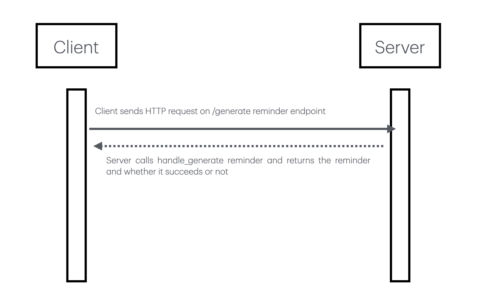

# task-notification-reminder-service
This microservice generates simple reminder messages based on task data for CS361 Sprint 2.

## Planned Features
- Generate reminders for active tasks
- Ignore completed tasks
- Reject requests with missing task data

## Communication Pipe
RESET API

## Developers
- Najhae Justice
- Sterling Jones
- Alexander Dewey

## description
This microservice automatically generates text-based reminders for pending tasks. It exposes a single REST API endpoint running on port 5001 that accepts a JSON payload detailing the task's properties. The service evaluates the task's completion status and builds a formatted reminder string if the task is still outstanding

## how to request
To programmatically request data from this microservice, send an HTTP `POST` request to the `/generate_reminder` endpoint on port 5001, providing a JSON payload containing `task_name`, `due_date`, and `completed` keys.

## how to recieve
To programmatically receive and process the data, first inspect the HTTP status code returned by the microservice to confirm a valid transaction before reading the JSON body.

## UML diagram




## Running the Microservice

Install required libraries:

```bash
pip install flask requests
```

Run the microservice:

```bash
python main.py
```

Run the test program:

```bash
python test_microservice_3.py
```
